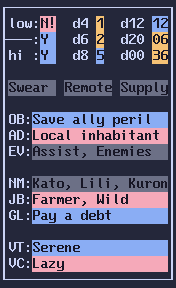
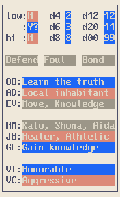
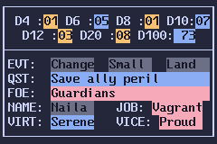
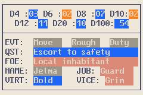

# ASCII Game Master

A Deno-powered GM card generator for solo TTRPGs. Generates random oracle rolls, NPC names, quest hooks, and personality
traits rendered in a fixed-width box-drawn card — to your terminal, as a PNG, or in your browser.

## Quick Start

```sh
deno task cli
```

Prints a colorized card to the terminal (macchiato dark theme).

## CLI

```sh
deno task cli [--theme macchiato|latte] [--layout portrait|landscape] [--count N] [--output-dir DIR] [--seed N]
```

| Option         | Default     | Description                                             |
| -------------- | ----------- | ------------------------------------------------------- |
| `--theme`      | `macchiato` | Catppuccin theme: `macchiato` (dark) or `latte` (light) |
| `--layout`     | `portrait`  | Card layout: `portrait` (22×18) or `landscape` (30×10)  |
| `--count`      | `1`         | Number of cards to generate                             |
| `--output-dir` | —           | Output directory for PNG files                          |
| `--seed`       | —           | Seed for reproducible generation                        |

Generate 50 light-theme PNGs:

```sh
deno task cli --theme latte --count 50 --output-dir cards
```

Reproduce the sample cards (portrait and landscape, both themes):

```sh
deno task cli --seed 42 --theme macchiato --layout portrait --output-dir .
deno task cli --seed 99 --theme latte --layout portrait --output-dir .
deno task cli --seed 42 --theme macchiato --layout landscape --output-dir .
deno task cli --seed 99 --theme latte --layout landscape --output-dir .
```

### Portrait (22×18)





### Landscape (30×10)





## Web App

```sh
deno task dev
```

Opens a browser at `http://localhost:8080` with:

- **Generate** — creates a new random card
- **Theme** — toggle macchiato (dark) / latte (light)
- **Layout** — toggle portrait (22×18) / landscape (30×10)
- **Image Mode** — pixel-perfect rendering from the BIOS ROM spritesheet
- **Canvas Mode** — monospace canvas text rendering (scalable)

### GitHub Pages

```sh
deno task build
```

Output goes to `docs/`. Configure GitHub Pages to serve from the `docs/` folder and commit.

## Legend

**Likely Odds**

- `low`: Likely (high chance)
- `───`: Even (50:50)
- `hi`: Unlikely (low chance)

Values: `Y` (Yes), `N` (No) with modifiers `!` (and…) and `?` (but…).

**Dice** — `d4`–`d20` standard RPG dice plus `d10`. `d00` is percentile (`00`–`99`), `d100` rolls 1–100 (landscape).
Dice rolls are colored **blue** when at least 50% of the die's maximum and **orange** otherwise.

**Event** — Ironsworn: Action, Location Descriptors, Theme.

**Quest** — One Page Solo Engine: objective, adversaries, action/topic focus.

**NPC** — Ironsworn: Ironlander Names, NPC Descriptors, Goals.

**Virtue/Vice** — Cairn character tables.

**Landscape (30×10)** — same card fit to GBA landscape. Two dice rows (`D4`/`D6`/`D8`/`D10` and `D12`/`D20`/`D100`,
where `D100` rolls 1–100 right-aligned), `EVT` = Action/Location/Theme in three columns, `QST` = objective/adversaries,
a single `NAME` with `JOB`, and `VIRT`/`VICE`. The `--seed`/theme is unchanged, so portrait and landscape cards roll
the same numbers.

## Project Structure

```
archive/                  Archived Python implementation
lib/                      Shared library (CLI + web)
├── text_generator.ts     Token-based text generation
├── oracle_data.ts        Oracle tables and card template
├── theme.ts              Catppuccin themes and colorization
├── card.ts               Card generation orchestration
├── spritesheet.ts        BIOS font glyph rendering (Canvas 2D)
└── terminal.ts           ANSI terminal output
cli.ts                    CLI entry point
www/                      Web app source
├── index.html
├── app.js
└── style.css
docs/                     Built site for GitHub Pages
scripts/
├── serve.ts              Dev server
└── build.ts              GitHub Pages build
```

## License

MIT
